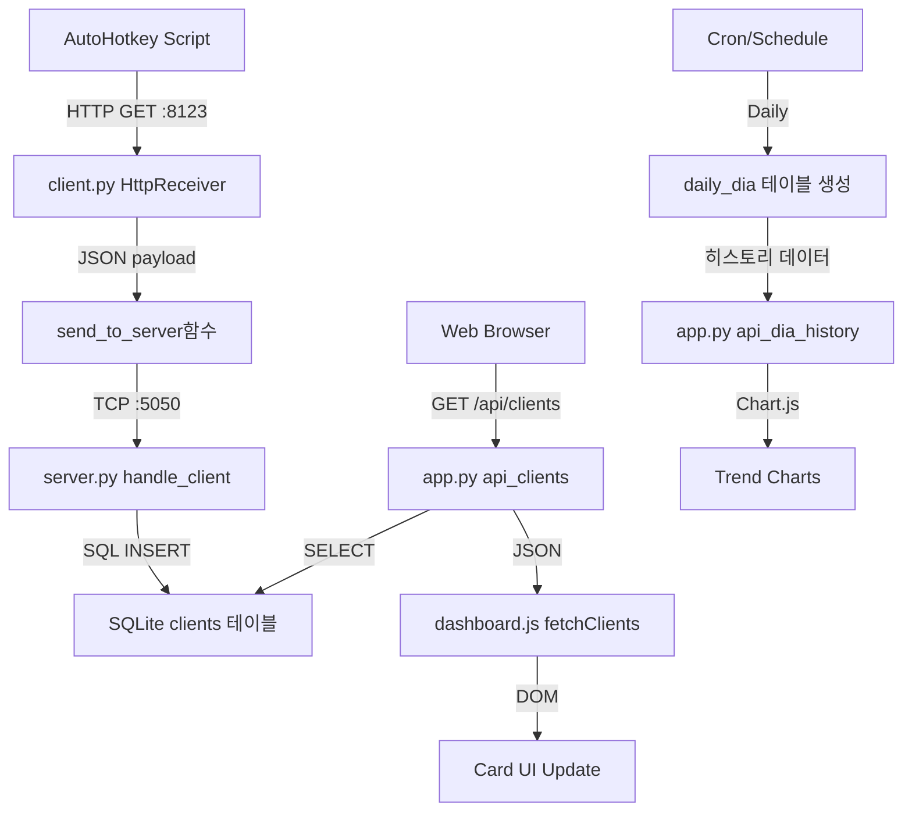

# 🔬 완전 코드 분석 문서 (COMPLETE CODE ANALYSIS)

## 📋 목차
1. [Python 파일 상세 분석](#python-파일-상세-분석)
2. [JavaScript 완전 분석](#javascript-완전-분석)
3. [HTML 구조 및 기능 분석](#html-구조-및-기능-분석)
4. [설정 파일 상세 분석](#설정-파일-상세-분석)
5. [데이터 흐름 및 연결점](#데이터-흐름-및-연결점)
6. [개선점 및 최적화 제안](#개선점-및-최적화-제안)

---

## 🐍 Python 파일 상세 분석

### 1. 📡 server.py - TCP 서버 (포트 5050)

#### 🔧 **핵심 함수 분석**

##### `now()` - 시간 포맷팅 함수
```python
def now():
    return datetime.datetime.now().strftime("%Y-%m-%d %H:%M:%S")
```
- **역할**: 현재 시간을 "YYYY-MM-DD HH:MM:SS" 형식으로 반환
- **사용처**: 로그 출력, DB 저장 시 타임스탬프
- **개선점**: timezone 정보 추가 필요

##### `load_config()` - 설정 파일 로더
```python
def load_config():
    try:
        with open(os.path.join(BASE_DIR, "settings.json"), "r", encoding="utf-8") as f:
            user = json.load(f)
            return {**DEFAULT_CONFIG, **user}
    except:
        return DEFAULT_CONFIG
```
- **역할**: settings.json 읽어서 기본 설정과 병합
- **매개변수**: 없음
- **반환값**: dict (설정 정보)
- **연결점**: `start_server()`에서 호출
- **개선점**: 구체적인 예외 처리, 설정 검증 로직 필요

##### `log(msg, file)` - 로그 출력 함수
```python
def log(msg, file):
    text = f"[{now()}] {msg}"
    print(text)
    try:
        with open(file, "a", encoding="utf-8") as f:
            f.write(text + "\n")
    except:
        pass
```
- **역할**: 콘솔과 파일에 동시 로그 출력
- **매개변수**:
  - `msg`: 로그 메시지 (str)
  - `file`: 로그 파일 경로 (str)
- **개선점**: 로그 레벨 구분, 로테이션 기능 추가

##### `handle_client(conn, addr, log_path)` - 클라이언트 요청 처리
```python
def handle_client(conn, addr, log_path):
    try:
        raw = conn.recv(2048)
        if not raw:
            log(f"⚠️ 수신 실패: 빈 데이터 (IP: {addr[0]})", log_path)
            return

        payload = json.loads(raw.decode("utf-8"))
        # 데이터 처리 로직
        store_client(payload)
    except Exception as e:
        log(f"⚠️ 수신 처리 실패: {e}", log_path)
    finally:
        conn.close()
```
- **역할**: 각 클라이언트 연결을 개별 스레드에서 처리
- **매개변수**:
  - `conn`: socket 연결 객체
  - `addr`: 클라이언트 주소 튜플 (ip, port)
  - `log_path`: 로그 파일 경로
- **데이터 흐름**: TCP 수신 → JSON 파싱 → DB 저장 → 생존 시간 갱신
- **개선점**: 타임아웃 설정, 데이터 검증 강화

##### `store_client(payload)` - 데이터베이스 저장
```python
def store_client(payload):
    with sqlite3.connect(DB_PATH) as thread_conn:
        thread_cursor = thread_conn.cursor()
        thread_cursor.execute("""
        INSERT OR REPLACE INTO clients
        (name, ip, game, server, dia, last_report, status, message)
        VALUES (?, ?, ?, ?, ?, ?, ?, ?)
        """, (
            payload.get("name", "unknown"),
            payload.get("ip", "?"),
            payload.get("game", "?"),
            payload.get("game_server", "?"),
            int(payload.get("dia", 0)),
            now(),
            "alive",
            payload.get("msg", "?")
        ))
        thread_conn.commit()
```
- **역할**: 클라이언트 상태를 SQLite DB에 저장
- **SQL**: INSERT OR REPLACE 사용하여 중복 방지
- **스레드 안전성**: 각 호출마다 새 DB 연결 생성
- **개선점**: 연결 풀링, 배치 처리 최적화

##### `watch_ahk(alert_sec, log_path)` - 생존 감시 스레드
```python
def watch_ahk(alert_sec, log_path):
    while True:
        now_ts = time.time()
        with ahk_lock:
            for name, last in list(ahk_map.items()):
                if now_ts - last > alert_sec:
                    mins = int((now_ts - last) // 60)
                    log(f"❗AHK 수신 중단 → {name} ({mins}분 이상)", log_path)
        time.sleep(60)
```
- **역할**: 백그라운드에서 클라이언트 생존 상태 감시
- **매개변수**:
  - `alert_sec`: 경고 임계값 (초)
  - `log_path`: 로그 파일 경로
- **동작 방식**: 60초마다 생존 시간 체크, 임계값 초과 시 경고
- **스레드 동기화**: `ahk_lock` 사용

##### `send_to_client(client_ip, message, log_path)` - 명령 전송
```python
def send_to_client(client_ip, message, log_path):
    try:
        with socket.socket(socket.AF_INET, socket.SOCK_STREAM) as sock:
            sock.connect((client_ip, 6000))
            sock.sendall(message.encode("utf-8"))
        log(f"📤 클라로 명령 전송 → {client_ip} | 내용: {message}", log_path)
    except Exception as e:
        log(f"⚠️ 클라 전송 실패 → {client_ip} | 오류: {e}", log_path)
```
- **역할**: 클라이언트로 명령어 전송 (포트 6000)
- **연결점**: 웹 대시보드나 외부 스크립트에서 호출
- **개선점**: 재시도 로직, 비동기 전송

---

### 2. 💻 client.py - 클라이언트 에이전트

#### 🔧 **핵심 함수 분석**

##### `load_config()` - 설정 파일 로더
```python
def load_config():
    path = os.path.join(BASE_DIR, "config.json")
    try:
        with open(path, "r", encoding="utf-8") as f:
            return json.load(f)
    except Exception as e:
        print(f"❌ config.json 로딩 실패: {e}")
        sys.exit(1)
```
- **역할**: config.json 로드, 실패 시 프로그램 종료
- **강제 종료**: 설정 파일 필수이므로 예외 시 sys.exit(1)
- **개선점**: 기본값 제공, 구체적 오류 메시지

##### `is_target_running()` - 대상 프로세스 확인
```python
def is_target_running():
    targets = config["targets"]
    for proc in psutil.process_iter(['name']):
        if proc.info['name'] in targets:
            return True
    return False
```
- **역할**: VM_Flow_LoY.exe, VM_Flow_NC.exe 실행 여부 확인
- **스텔스 모드**: 대상 프로세스 실행 중일 때만 명령 처리
- **사용처**: CommandReceiver 스레드에서 명령 수신 전 체크

##### `get_running_target()` - 실행 중인 대상명 반환
```python
def get_running_target():
    aliases = config["target_alias"]
    for proc in psutil.process_iter(['name']):
        if proc.info['name'] in aliases:
            return aliases[proc.info['name']]
    return "NONE"
```
- **매핑**: 실제 프로세스명 → 표시명
  - `VM_Flow_LoY.exe` → `LoY`
  - `VM_Flow_NC.exe` → `NC`

##### `send_to_server(server_ip, report_ip, name, diamond, mode, game, msg, game_server)`
```python
def send_to_server(server_ip, report_ip, name, diamond, mode="send", game="unknown", msg="", game_server=""):
    payload = {
        "name": name,
        "ip": report_ip,
        "dia": diamond,
        "mode": mode,
        "game": game,
        "msg": msg,
        "game_server": game_server
    }
    try:
        s = socket.socket(socket.AF_INET, socket.SOCK_STREAM)
        s.settimeout(3)
        s.connect((server_ip, SEND_PORT))
        s.sendall(json.dumps(payload).encode("utf-8"))
        s.close()
    except Exception as e:
        log(f"❌ 서버 전송 실패: {e}")
```
- **역할**: 서버로 상태 데이터 전송
- **타임아웃**: 3초 설정
- **JSON 페이로드**: 클라이언트 상태 정보 직렬화
- **연결점**: HttpReceiver에서 AutoHotkey 요청 받아서 호출

##### `CommandReceiver` 클래스 - 명령 수신 스레드
```python
class CommandReceiver(threading.Thread):
    def run(self):
        s = socket.socket(socket.AF_INET, socket.SOCK_STREAM)
        s.bind(('0.0.0.0', CMD_RECV_PORT))
        s.listen(1)
        while True:
            conn, addr = s.accept()
            try:
                data = conn.recv(1024).decode("utf-8").strip()
                if data:
                    if not is_target_running():
                        log("🥷 대상 실행 안 됨 — 명령 무시 (스텔스 모드)")
                        continue
                    save_command_to_ini(data)
            finally:
                conn.close()
```
- **포트**: 6000 (server.py에서 전송)
- **스텔스 모드**: 대상 프로세스 없으면 명령 무시
- **INI 저장**: 수신 명령을 INI 파일로 저장

##### `HttpReceiver` 클래스 - AutoHotkey HTTP 요청 처리
```python
class SendHttpHandler(http.server.BaseHTTPRequestHandler):
    def do_GET(self):
        parsed = urllib.parse.urlparse(self.path)
        if parsed.path == "/send":
            params = urllib.parse.parse_qs(parsed.query)
            # 파라미터 추출 및 서버 전송
            send_to_server(SERVER_IP, ip, name, dia, mode, game, msg, game_server)
```
- **포트**: 8123
- **URL**: `http://localhost:8123/send?dia=1000&name=client1&ip=...`
- **역할**: AutoHotkey 스크립트에서 HTTP GET 요청으로 데이터 전송

##### `save_command_to_ini(command_msg)` - INI 파일 저장
```python
def save_command_to_ini(command_msg):
    ini = configparser.ConfigParser()
    ini["Command"] = {
        "Last": command_msg,
        "Timestamp": now(),
        "Executed": "False",
        "Target": get_running_target()
    }
    try:
        with open(INI_FILE, "w", encoding="utf-8") as f:
            ini.write(f)
    except Exception as e:
        log(f"❌ INI 저장 실패: {e}")
```
- **역할**: 수신 명령을 MessageCache.ini에 저장
- **AutoHotkey 연동**: AHK 스크립트가 이 INI 파일을 읽어서 실행
- **필드**: Last(명령), Timestamp(시간), Executed(실행여부), Target(대상)

##### 로그 관리 함수들
```python
def manage_debug_log(config):
    # 로그 크기/날짜 체크하여 회전/삭제
def rotate_log(path):
    # 로그 파일 회전 (.1, .2로 백업)
def trim_message_cache(path, max_lines):
    # 메시지 캐시 줄 수 제한
```
- **로그 회전**: 크기/날짜 기준으로 자동 관리
- **캐시 정리**: 메시지 캐시 파일 크기 제한

---

### 3. 🌐 board/app.py - Flask 웹 서버 (포트 8000)

#### 🔧 **라우트 및 함수 분석**

##### `@app.route('/')` - 메인 대시보드
```python
@app.route('/')
def dashboard():
    with sqlite3.connect(DB_PATH) as conn:
        conn.row_factory = sqlite3.Row
        rows = conn.execute(
            "SELECT * FROM clients ORDER BY last_report DESC"
        ).fetchall()
    return render_template('dashboard.html', data=rows)
```
- **역할**: 메인 카드 대시보드 페이지 렌더링
- **DB 쿼리**: clients 테이블에서 최신 보고 순으로 정렬
- **템플릿**: dashboard.html에 데이터 전달
- **연결점**: JavaScript fetchClients()가 이 데이터 사용

##### `@app.route('/api/clients')` - 클라이언트 API
```python
@app.route('/api/clients')
def api_clients():
    with sqlite3.connect(DB_PATH) as conn:
        conn.row_factory = sqlite3.Row
        rows = conn.execute(
            "SELECT * FROM clients ORDER BY last_report DESC"
        ).fetchall()
    return jsonify([dict(r) for r in rows])
```
- **역할**: 클라이언트 상태 데이터를 JSON으로 반환
- **AJAX 연결점**: dashboard.js의 fetchClients()에서 호출
- **데이터 형식**:
```json
[
  {
    "name": "NC-테오필-01",
    "ip": "192.168.1.100",
    "game": "NC",
    "server": "테오필",
    "dia": 50000,
    "last_report": "2025-01-14 15:30:00",
    "status": "alive",
    "message": "정상 동작"
  }
]
```

##### `@app.route('/dia-history')` - 히스토리 페이지
```python
@app.route('/dia-history')
def dia_history_page():
    return render_template('dia-history.html')
```
- **역할**: 다이아 히스토리 차트 페이지 렌더링
- **정적 페이지**: 실제 데이터는 JavaScript에서 API 호출

##### `@app.route('/api/dia-history')` - 히스토리 API
```python
@app.route('/api/dia-history')
def api_dia_history():
    days = int(request.args.get('days', 7))
    today = datetime.date.today()

    wanted = [
        (today - datetime.timedelta(days=i)).isoformat()
        for i in range(days)
    ]

    placeholders = ','.join('?' * len(wanted))
    sql = f"""
    SELECT
      substr(date,1,10) AS day,
      name, game, server, dia
    FROM daily_dia
    WHERE substr(date,1,10) IN ({placeholders})
    ORDER BY day ASC, name ASC
    """

    with sqlite3.connect(DB_PATH) as conn:
        rows = conn.execute(sql, wanted).fetchall()

    # 데이터 가공 및 diff 계산
    stats = {d: {'TOTAL': 0} for d in wanted}
    for r in rows:
        d = r['day']
        stats[d][r['name']] = {
            'today': r['dia'],
            'diff': 0,  # 전일 대비 계산
            'game': r['game'],
            'server': r['server']
        }
        stats[d]['TOTAL'] += r['dia']

    return jsonify(stats)
```
- **역할**: 일별 다이아 히스토리 데이터 반환
- **매개변수**: `?days=7` (조회 일수)
- **데이터 가공**: 날짜별/클라이언트별 집계, 전일 대비 증감 계산
- **차트 연동**: Chart.js에서 이 데이터로 그래프 생성

---

## 📜 JavaScript 완전 분석

### 🎯 dashboard.js - 프론트엔드 핵심 로직

#### **전역 변수**
```javascript
let condensed = false;      // 간결 모드 상태
let serverFilter = null;    // 서버 필터 (null = 전체)
```

#### **유틸리티 함수들**

##### `generateSparkline(values)` - 스파크라인 생성
```javascript
function generateSparkline(values) {
  const blocks = "▁▂▃▄▅▆▇█";
  const min = Math.min(...values);
  const max = Math.max(...values);
  const range = max - min || 1;

  return values.map(val => {
    const level = Math.floor(((val - min) / range) * (blocks.length - 1));
    return blocks[level];
  }).join('');
}
```
- **역할**: 숫자 배열을 유니코드 블록으로 미니 차트 생성
- **사용처**: 다이아 히스토리에서 트렌드 시각화
- **알고리즘**: 최소/최대값 정규화 → 8단계 블록 매핑

##### `trimTimestamp(ts)` - 타임스탬프 간소화
```javascript
function trimTimestamp(ts) {
    return ts.replace(/^20\d\d-/, '');
}
```
- **역할**: "2025-01-14 15:30:00" → "01-14 15:30:00"
- **UI 최적화**: 카드에서 공간 절약

##### `getThresholdMs()` - 임계값 계산
```javascript
function getThresholdMs() {
    const el = document.getElementById("threshold");
    if (!el) return 300000; // 기본값: 5분
    return parseInt(el.value) * 60 * 1000;
}
```
- **역할**: 드롭다운에서 선택한 분 값을 밀리초로 변환
- **기본값**: 5분 (300000ms)

#### **핵심 AJAX 함수**

##### `fetchClients()` - 메인 데이터 갱신 함수
```javascript
async function fetchClients() {
    const threshold = getThresholdMs();
    const now = Date.now();
    const clientOrder = getClientOrder();

    try {
        // 1) API에서 데이터 가져오기
        const res = await fetch("/api/clients");
        const data = await res.json();

        updateServerSummary(data);

        // 2) 그리드 컨테이너 찾기
        const grid = document.getElementById("dashboard");

        // 3) 클라이언트 맵 생성
        const clientMap = {};
        data.forEach(c => {
            clientMap[c.name] = c;
        });

        // 4) 카드 생성/업데이트
        names.forEach(name => {
            const existing = grid.querySelector(`.card[data-name="${name}"]`);
            const c = clientMap[name];

            if (existing) {
                // 기존 카드 업데이트
                existing.innerHTML = condensed ? 간결모드HTML : 전체모드HTML;
            } else {
                // 새 카드 생성
                const card = document.createElement("div");
                card.className = c ? "card" : "card empty";
                const age = now - new Date(c.last_report).getTime();
                const barColor = age < threshold ? "#28a745" : "#dc3545";
                card.style.borderLeftColor = barColor;
                grid.appendChild(card);
            }
        });

        // 5) Sortable.js 초기화
        if (grid._sortableInstance) {
            grid._sortableInstance.destroy();
        }
        grid._sortableInstance = Sortable.create(grid, {
            animation: 150,
            swap: true,
            onEnd: () => {
                const newOrder = Array.from(grid.children)
                    .map(c => c.dataset.name);
                setClientOrder(newOrder);
            }
        });

        applyFilters();
    } catch (err) {
        console.error("fetchClients 중 예외 발생:", err);
    }
}
```
- **역할**: 클라이언트 데이터 갱신 및 카드 UI 렌더링
- **API 호출**: `/api/clients` → JSON 응답
- **카드 시스템**:
  - 기존 카드는 innerHTML만 업데이트 (성능 최적화)
  - 새 카드는 DOM 요소 생성
  - 빈 카드도 지원 (사용자가 직접 추가)
- **드래그 앤 드롭**: Sortable.js로 카드 순서 변경
- **상태 표시**:
  - 초록 테두리: 최근 보고 (임계값 이내)
  - 빨강 테두리: 오래된 보고 (오프라인)

##### `updateServerSummary(data)` - 서버 요약 정보
```javascript
function updateServerSummary(data) {
    // 1) 서버별 다이아 합계 계산
    const summary = {};
    data.forEach(c => {
        if (!c.server) return;
        summary[c.server] = (summary[c.server] || 0) + Number(c.dia || 0);
    });

    // 2) 서버별 링크 생성 (클릭 시 필터 적용)
    const serverLinks = Object.entries(summary)
        .map(([server, total]) => {
            const active = server === serverFilter ? 'active' : '';
            return `<span class="${active}"
                    onclick="setServerFilter('${server}')">
                ${server}: ${total.toLocaleString()}
              </span>`;
        }).join(' | ');

    // 3) 페이지 구분 (카드보드 vs 다이아보드)
    const isDiaBoard = location.pathname.includes('dia-history');
    const btnLabel = isDiaBoard ? '모니터' : '추적';
    const btnHref = isDiaBoard ? '/' : '/static/dia-history.html';

    const html = isDiaBoard
        ? `다이아 합산 → ${serverLinks} ${historyBtn}`
        : `다이아 합산 → ${serverLinks} | ${allLink} ${historyBtn}`;

    document.getElementById("serverSummary").innerHTML = html;
}
```
- **역할**: 좌상단 서버별 다이아 요약 표시
- **동적 필터링**: 서버명 클릭 시 해당 서버만 표시
- **페이지별 버튼**:
  - 대시보드 → "📅 추적" (히스토리로)
  - 히스토리 → "📺 모니터" (대시보드로)

#### **필터링 시스템**

##### `applyFilters()` - 통합 필터 적용
```javascript
function applyFilters() {
    const q = document.getElementById("searchInput")?.value.trim().toLowerCase();
    const minDia = parseInt(document.getElementById("minDiaInput")?.value || "0");
    const server = serverFilter;

    document.querySelectorAll(".card").forEach(card => {
        const isEmpty = card.classList.contains("empty");
        const serverName = card.dataset.server || "";
        const fullText = card.textContent.toLowerCase();

        const matchesText = !q || fullText.includes(q);
        const matchesServer = !server || isEmpty || serverName === server;

        let matchesDia = true;
        if (!isEmpty && minDia > 0) {
            const diaValue = parseInt(card.dataset.dia || "0");
            matchesDia = !isNaN(diaValue) && diaValue >= minDia;
        }

        const shouldDisplay = matchesText;
        card.classList.remove("ghost-card");

        if (shouldDisplay) {
            card.style.display = "";
            const shouldGhost = !matchesServer || !matchesDia;
            if (shouldGhost) card.classList.add("ghost-card");
        } else {
            card.style.display = "none";
        }
    });
}
```
- **3단계 필터링**:
  1. **텍스트 검색**: 카드 내 모든 텍스트 대상
  2. **서버 필터**: 특정 서버만 표시
  3. **다이아 필터**: 최소 다이아 수량 이상
- **UI 효과**:
  - `display: none`: 완전 숨김 (텍스트 불일치)
  - `ghost-card` 클래스: 반투명 표시 (서버/다이아 불일치)

#### **로컬 스토리지 관리**

##### 카드 순서 저장/복원
```javascript
function getClientOrder() {
    return JSON.parse(localStorage.getItem("clientOrder") || "[]");
}

function setClientOrder(order) {
    localStorage.setItem("clientOrder", JSON.stringify(order));
}
```
- **역할**: 사용자가 드래그로 변경한 카드 순서 영구 저장
- **데이터**: 클라이언트명 배열 `["NC-테오필-01", "LoY-실레안-02", ...]`

#### **차트 렌더링 함수들**

##### `renderTotalTrendChart(dayCount, win)` - 전체 트렌드
```javascript
function renderTotalTrendChart(dayCount, win = window) {
    const totalUrl = `/api/dia-history?days=${dayCount}`;

    fetch(totalUrl)
        .then(res => res.json())
        .then(dataMap => {
            const allDates = Object.keys(dataMap).sort();
            const dates = dayCount > 0 && dayCount < allDates.length
                ? allDates.slice(-dayCount)
                : allDates;

            const values = dates.map(date => {
                const tot = dataMap[date].TOTAL;
                return typeof tot === "number" ? tot : tot?.today || 0;
            });

            // Chart.js 차트 생성
            const canvas = win.document.getElementById("totalTrendChart");
            const ctx = canvas.getContext("2d");
            new Chart(ctx, {
                type: "line",
                data: {
                    labels: dates,
                    datasets: [{
                        label: `TOTAL (${dayCount === 999 ? "전체" : dayCount + "일"})`,
                        data: values,
                        borderColor: "#007bff",
                        backgroundColor: "rgba(0,123,255,0.1)",
                        tension: 0.3,
                        fill: true
                    }]
                }
            });
        });
}
```
- **API 연동**: `/api/dia-history?days=N`
- **Chart.js**: 라인 차트로 TOTAL 다이아 트렌드 표시
- **동적 기간**: 3일/7일/30일/전체 버튼

##### `renderServerTrendChart(dayCount, win)` - 서버별 트렌드
- **다중 데이터셋**: 서버마다 다른 색상의 라인
- **서버 추출**: 각 날짜의 데이터에서 server 필드 수집
- **합계 계산**: 같은 서버의 모든 클라이언트 다이아 합산

#### **히스토리 페이지 전용 함수들**

##### `renderDiaHistoryContent(win, server, name)` - 히스토리 렌더링
```javascript
function renderDiaHistoryContent(win, server = null, name = null) {
    const container = win.document.querySelector("#diaHistoryContent .history-text");
    const raw = localStorage.getItem("dailyDiaStats");
    const data = JSON.parse(raw);
    const dates = Object.keys(data).sort().reverse();

    for (const date of dates) {
        const dayData = data[date];
        const block = win.document.createElement("div");
        block.className = "date-group";

        // 접히는 토글 헤더
        const toggle = win.document.createElement("div");
        toggle.className = "date-toggle";
        toggle.innerHTML = `<span class="drop-icon">▾</span> ${date}`;

        // 클라이언트별 데이터
        const filtered = Object.keys(dayData).filter(key => {
            const belongsToServer = !server || key.startsWith(server + "-");
            const matchesName = !name || key === name;
            return belongsToServer && matchesName;
        });

        const sorted = filtered.sort((a, b) => {
            const aVal = dayData[a]?.today || 0;
            const bVal = dayData[b]?.today || 0;
            return aVal - bVal; // 오름차순
        });

        sorted.forEach(cli => {
            const entry = dayData[cli];
            const val = entry.today ?? 0;
            const diff = entry.diff ?? 0;
            const arrow = diff < 0 ? "🔻" : diff > 0 ? "🔺" : "➖";

            // 스파크라인 생성 (최근 14일 트렌드)
            const rawVals = dates.sort().slice(-14).map(date => {
                const v = data[date]?.[cli]?.today;
                return typeof v === "number" ? v : 0;
            });
            const spark = generateSparkline(rawVals);

            const line = win.document.createElement("div");
            line.className = "client-line";
            line.innerHTML = `
                <span class="text">${entry.game} | ${entry.server} | ${cli} ${val.toLocaleString()} ${arrow} ${diff.toLocaleString()}</span>
                <span class="spark">${spark}</span>
            `;
            content.appendChild(line);
        });

        // TOP 3 상승/하락 표시
        const topRise = sorted
            .filter(k => dayData[k]?.diff > 0)
            .sort((a, b) => dayData[b].diff - dayData[a].diff)
            .slice(0, 3);
        // ...TOP 박스 생성
    }
}
```
- **날짜별 그룹**: 오늘 → 어제 → 그저께 순
- **접히는 UI**: 오늘만 펼치고 나머지는 접힘
- **필터링**: 서버/클라이언트명으로 제한
- **스파크라인**: 각 클라이언트의 14일 트렌드 미니 차트
- **TOP 랭킹**: 상승/하락 TOP 3 별도 표시

##### `showDiaHistory()` - 팝업 히스토리 (legacy)
```javascript
function showDiaHistory() {
    const win = window.open("", "DiaHistoryWindow", "width=1920,height=1080");
    // 팝업창에 HTML/CSS/JS 동적 생성
    // localStorage에서 데이터 읽어서 렌더링
}
```
- **팝업 방식**: 별도 창에서 히스토리 표시
- **현재**: `/static/dia-history.html`로 대체됨

#### **이벤트 핸들러들**

##### DOM 로드 이벤트
```javascript
window.addEventListener("DOMContentLoaded", () => {
    // 1) 대시보드 페이지
    const dash = document.getElementById("dashboard");
    if (dash) {
        fetchClients();
        setInterval(fetchClients, 5000); // 5초마다 갱신
        return;
    }

    // 2) 히스토리 페이지
    const dia = document.getElementById("diaHistoryContent");
    if (dia) {
        fetch("/api/dia-history?days=7")
            .then(res => res.json())
            .then(stats => {
                localStorage.setItem("dailyDiaStats", JSON.stringify(stats));
                renderDiaHistoryContent(window);
                renderTotalTrendChart(7, window);
                renderServerTrendChart(7, window);
            });
    }
});
```
- **페이지별 초기화**: DOM ID로 페이지 구분
- **자동 갱신**: 대시보드는 5초마다 데이터 새로고침
- **히스토리 로딩**: API에서 7일치 데이터 받아서 localStorage 저장

---

## 🏗️ HTML 구조 및 기능 분석

### 1. 📊 dashboard.html - 메인 대시보드

#### **Head 섹션**
```html
<head>
    <meta charset="UTF-8">
    <title>클라이언트 상태 보드</title>
    <script src="https://cdn.jsdelivr.net/npm/sortablejs@1.15.0/Sortable.min.js"></script>
    <script src="https://cdn.jsdelivr.net/npm/chart.js"></script>
    <script src="{{ url_for('static', filename='dashboard.js') }}"></script>
</head>
```

**외부 라이브러리:**
- **Sortable.js**: 드래그 앤 드롭 카드 순서 변경
- **Chart.js**: 트렌드 차트 렌더링
- **dashboard.js**: 메인 JavaScript 로직

#### **CSS 스타일 분석**

##### 카드 그리드 시스템
```css
.grid {
    display: flex;
    flex-wrap: wrap;
    gap: 6px;
    justify-content: flex-start;
    margin-top: 48px;
}

.card {
    width: calc((100% - 19 * 4px) / 20); /* 20개 카드 기준 자동 계산 */
    max-width: 90px;
    background: #fcfcfc;
    font-size: 0.68em;
    border: 1px solid #999;
    border-left: 3px solid #555; /* 상태 표시 바 */
    border-radius: 8px;
    box-shadow: 0 2px 4px rgba(0, 0, 0, 0.08);
    transition: transform 0.15s ease-in-out;
}
```

**레이아웃 특징:**
- **Flexbox**: 반응형 그리드
- **동적 폭**: 20개 카드 기준으로 자동 계산
- **상태 바**: 좌측 테두리 색상으로 온라인/오프라인 표시
- **호버 효과**: `transform: translateY(-3px) scale(1.03)`

##### 드래그 앤 드롭 스타일
```css
.highlight {
    outline: 2px dashed #007bff;
    border-radius: 6px;
}

.ghost-card {
    opacity: 0.25;
    filter: grayscale(60%);
    background-color: #f2f2f2;
    pointer-events: none;
}
```

**시각적 피드백:**
- **highlight**: 드롭 대상 표시
- **ghost-card**: 필터 불일치 카드 반투명 처리

#### **HTML 구조**

##### 검색/필터 바
```html
<div id="searchBar" style="text-align: center; margin-top: 8px;">
    <input id="minDiaInput" type="number" placeholder="다이아 ≥" oninput="applyFilters()" />
    <input id="searchInput" oninput="applyFilters()" placeholder="카드 이름 / 서버 검색..." />
</div>
```
- **다이아 필터**: 최소 다이아 수량 입력
- **텍스트 검색**: 실시간 검색 (oninput 이벤트)

##### 상단 컨트롤
```html
<div class="button-bar">
    <button onclick="addEmptyCard()">빈 카드 추가</button>
    <button id="toggle-btn" onclick="toggleCondensed()">간결 모드</button>
    <select id="threshold" onchange="fetchClients()">
        <option value="5">5분 기준</option>
        <option value="10">10분 기준</option>
        <!-- ... -->
    </select>
</div>
```
- **빈 카드**: 사용자 정의 플레이스홀더
- **간결 모드**: 카드 정보 축약 표시
- **임계값**: 온라인/오프라인 판단 기준 시간

##### 서버 요약
```html
<div class="server-summary" id="serverSummary">서버 요약</div>
```
- **위치**: 좌상단 고정
- **내용**: JavaScript로 동적 생성 (서버별 다이아 합계)

##### 메인 그리드
```html
<div class="grid" id="dashboard"></div>
```
- **카드 컨테이너**: JavaScript로 카드 요소들 동적 생성
- **Sortable**: 드래그 앤 드롭 활성화

### 2. 📅 dia-history.html - 다이아 히스토리

#### **레이아웃 구조**
```html
<div class="layout">
    <div class="history-column">
        <!-- 좌측: 일별 히스토리 리스트 -->
        <div id="diaHistoryContent">
            <div class="history-text">⏳ 데이터 불러오는 중...</div>
        </div>
    </div>

    <div class="chart-column">
        <!-- 우측: 차트 영역 -->
        <div>
            <h2>📊 TOTAL 추세 그래프</h2>
            <div class="chart-toolbar">
                <button onclick="renderTotalTrendChart(3, window)">3일</button>
                <!-- ... -->
            </div>
            <canvas id="totalTrendChart" width="960" height="300"></canvas>
        </div>
    </div>
</div>
```

**2단 레이아웃:**
- **좌측 (550px)**: 일별 히스토리 텍스트
- **우측 (flex: 1)**: 차트 2개 수직 배치

#### **스타일 특징**

##### 히스토리 컬럼
```css
.history-column {
    flex: 0 0 550px;
    max-height: 840px;
    overflow-y: auto;
    overflow-x: hidden;
}
```

##### 클라이언트 라인
```css
.client-line {
    display: flex;
    justify-content: space-between;
    white-space: nowrap;
    font-family: 'Segoe UI', sans-serif;
    font-size: 15px;
}
```
- **좌우 분리**: 텍스트 정보 ↔ 스파크라인
- **nowrap**: 줄바꿈 방지

#### **JavaScript 인라인**

##### DOMContentLoaded 핸들러
```html
<script>
    window.addEventListener("DOMContentLoaded", () => {
        // 함수 전역 등록
        win.renderDiaHistoryContent = renderDiaHistoryContent;
        win.renderTotalTrendChart = renderTotalTrendChart;
        win.renderServerTrendChart = renderServerTrendChart;

        // 초기 렌더링
        renderDiaHistoryContent(win);
        renderTotalTrendChart(7, win);
        renderServerTrendChart(7, win);
    });
</script>
```

##### 서버 필터 버튼 생성
```javascript
const raw = localStorage.getItem("dailyDiaStats");
const data = JSON.parse(raw || "{}");
const serverSet = new Set();

// 서버명 추출
Object.values(data).forEach(day => {
    Object.keys(day).forEach(name => {
        if (!["TOTAL", "SERVER_SUM", "COUNT_BY_SERVER"].includes(name)) {
            const server = name.split("-")[0];
            serverSet.add(server);
        }
    });
});

// 버튼 생성
Array.from(serverSet).sort().forEach(server => {
    const btn = document.createElement("button");
    btn.textContent = server;
    btn.onclick = () => renderDiaHistoryContent(win, server);
    serverDiv.appendChild(btn);
});
```

**동적 필터링:**
- localStorage에서 서버 목록 추출
- 각 서버별 필터 버튼 동적 생성
- 클릭 시 해당 서버만 표시

---

## ⚙️ 설정 파일 상세 분석

### 1. 📄 client/config.json - 클라이언트 설정

```json
{
  "version_file": "VERSION.txt",

  "server": {
    "ip": "172.30.101.232",
    "send_port": 54321,
    "recv_port": 6000,
    "http_port": 8123
  },

  "client": {
    "listen_port": 54321,
    "log_file": "client_debug.log",
    "msg_file": "MessageCache.txt",
    "ini_file": "MessageCache.ini",
    "mutex_name": "Global\\MY_CLIENT_MUTEX_LOCK",
    "message_cache_max_lines": 1000,
    "log_max_size_mb": 5,
    "log_max_age_days": 7
  },

  "targets": [
    "VM_Flow_LoY.exe",
    "VM_Flow_NC.exe"
  ],

  "target_alias": {
    "VM_Flow_LoY.exe": "LoY",
    "VM_Flow_NC.exe": "NC"
  },

  "sensitive_commands": [
    "RESTART", "SHUTDOWN", "EXIT", "KILL"
  ],

  "command_whitelist": [
    "START", "STOP", "SYNC", "REBOOT", "DIAMOND"
  ],

  "report": {
    "interval_sec": 58,
    "enabled": true
  }
}
```

#### **설정값 분석**

##### 서버 연결 설정
- **`server.ip`**: 중앙 서버 주소
- **`server.send_port`**: 54321 ⚠️ **불일치 문제** (실제 server.py는 5050 사용)
- **`server.recv_port`**: 6000 (명령 수신)
- **`server.http_port`**: 8123 (AutoHotkey HTTP)

##### 클라이언트 설정
- **`client.log_file`**: 디버그 로그 파일명
- **`client.msg_file`**: 메시지 캐시 파일
- **`client.ini_file`**: AutoHotkey용 INI 파일
- **`client.mutex_name`**: 중복 실행 방지용 뮤텍스
- **`client.message_cache_max_lines`**: 메시지 캐시 최대 줄 수
- **`client.log_max_size_mb`**: 로그 파일 최대 크기 (회전 기준)
- **`client.log_max_age_days`**: 로그 파일 최대 보존 일수

##### 대상 프로세스 설정
- **`targets`**: 감시할 프로세스명 배열
- **`target_alias`**: 프로세스명 → 표시명 매핑

##### 명령 보안 설정
- **`sensitive_commands`**: 위험한 명령어 (INI에 저장 후 즉시 삭제)
- **`command_whitelist`**: 허용된 명령어 (현재 사용 안 함)

##### 보고 설정
- **`report.interval_sec`**: 58초 (서버 임계값과 연동)
- **`report.enabled`**: 자동 보고 활성화 여부

### 2. 📄 server/settings.json - 서버 설정

```json
{
  "server_ip": "172.30.101.232",
  "server_port": 54321,
  "client_listen_port": 8123,
  "log_path": "server_log.txt",
  "debug_log_path": "client_debug.log",
  "report_interval_sec": 58
}
```

#### **설정값 분석**

##### 네트워크 설정
- **`server_ip`**: 바인드 주소 (0.0.0.0 권장)
- **`server_port`**: 54321 ⚠️ **실제 코드와 불일치** (실제는 5050)
- **`client_listen_port`**: 8123 (사용되지 않음)

##### 로그 설정
- **`log_path`**: 서버 로그 파일
- **`debug_log_path`**: 디버그 로그 (사용되지 않음)

##### 감시 설정
- **`report_interval_sec`**: 58초 (클라이언트와 동일해야 함)

#### **⚠️ 설정 문제점들**

1. **포트 불일치**:
   ```
   config.json: send_port = 54321
   settings.json: server_port = 54321
   server.py 실제: port = 5050 (DEFAULT_CONFIG)
   ```

2. **사용되지 않는 설정**:
   - `client_listen_port` (server/settings.json)
   - `command_whitelist` (client/config.json)
   - `debug_log_path` (server/settings.json)

3. **하드코딩된 값들**:
   - client.py의 `SEND_PORT = config["server"]["send_port"]` vs 실제 서버 포트
   - server.py의 `DEFAULT_CONFIG`가 settings.json보다 우선

---

## 🔄 데이터 흐름 및 연결점

### 1. **전체 시스템 데이터 흐름**



### 2. **연결점 상세 분석**

#### **AutoHotkey ↔ Client 연결**
```
HTTP URL: http://localhost:8123/send?dia=1000&name=client1&ip=192.168.1.100&game=NC&server=테오필&msg=정상동작

client.py 파싱:
- urllib.parse.parse_qs()로 파라미터 추출
- send_to_server()로 JSON 변환하여 서버 전송
```

#### **Client ↔ Server 연결**
```
JSON Payload:
{
    "name": "NC-테오필-01",
    "ip": "192.168.1.100",
    "dia": 1000,
    "mode": "send",
    "game": "NC",
    "msg": "정상동작",
    "game_server": "테오필"
}

TCP Socket: client_ip:random → server_ip:5050
```

#### **Server ↔ Database 연결**
```sql
INSERT OR REPLACE INTO clients
(name, ip, game, server, dia, last_report, status, message)
VALUES (?, ?, ?, ?, ?, ?, ?, ?)

스레드 안전성: 매 호출마다 새 DB 연결 생성
```

#### **Database ↔ Web API 연결**
```python
# app.py
@app.route('/api/clients')
def api_clients():
    rows = conn.execute("SELECT * FROM clients ORDER BY last_report DESC")
    return jsonify([dict(r) for r in rows])
```

#### **Web API ↔ Frontend 연결**
```javascript
// dashboard.js
const res = await fetch("/api/clients");
const data = await res.json();

data.forEach(client => {
    // 카드 DOM 업데이트
    card.innerHTML = `
        <div class="name">${client.name}</div>
        <div class="info">
            ${client.ip}<br>
            ${client.game} (${client.server})<br>
            ${client.dia}<br>
            ${client.status.toUpperCase()}
        </div>
    `;
});
```

### 3. **명령 전송 흐름 (역방향)**

```
관리자 → server.py send_to_client() → TCP :6000 → client.py CommandReceiver
→ save_command_to_ini() → MessageCache.ini → AutoHotkey Script 읽기
```

---

## 🚀 개선점 및 최적화 제안

### 1. **긴급 수정 필요 사항**

#### 포트 설정 통일
```json
// 수정된 client/config.json
{
    "server": {
        "ip": "172.30.101.232",
        "send_port": 5050,  // ← 5050으로 통일
        "recv_port": 6000,
        "http_port": 8123
    }
}

// 수정된 server/settings.json
{
    "server_port": 5050,  // ← 5050으로 통일
}
```

#### 예외 처리 강화
```python
# server.py 개선
def handle_client(conn, addr, log_path):
    try:
        conn.settimeout(10)  # 타임아웃 추가
        raw = conn.recv(2048)

        if not raw:
            raise ValueError("빈 데이터 수신")

        try:
            payload = json.loads(raw.decode("utf-8"))
        except json.JSONDecodeError as e:
            log(f"JSON 파싱 오류: {e}, 원본 데이터: {raw}", log_path)
            return

        # 데이터 검증
        required_fields = ['name', 'ip', 'dia']
        for field in required_fields:
            if field not in payload:
                raise ValueError(f"필수 필드 누락: {field}")

        store_client(payload)

    except socket.timeout:
        log(f"클라이언트 타임아웃: {addr[0]}", log_path)
    except Exception as e:
        log(f"처리 오류: {e}", log_path)
    finally:
        try:
            conn.close()
        except:
            pass
```

### 2. **성능 최적화**

#### 데이터베이스 최적화
```sql
-- 인덱스 추가
CREATE INDEX idx_clients_last_report ON clients(last_report);
CREATE INDEX idx_clients_server ON clients(server);
CREATE INDEX idx_daily_dia_date ON daily_dia(date);

-- 연결 풀링 (Python)
import sqlite3
from contextlib import contextmanager

class DBPool:
    def __init__(self, db_path, pool_size=5):
        self.db_path = db_path
        self.pool = queue.Queue(maxsize=pool_size)
        for _ in range(pool_size):
            conn = sqlite3.connect(db_path, check_same_thread=False)
            conn.row_factory = sqlite3.Row
            self.pool.put(conn)

    @contextmanager
    def get_connection(self):
        conn = self.pool.get()
        try:
            yield conn
        finally:
            self.pool.put(conn)
```

#### 프론트엔드 최적화
```javascript
// 가상 스크롤링 (많은 카드용)
class VirtualGrid {
    constructor(container, itemHeight = 120) {
        this.container = container;
        this.itemHeight = itemHeight;
        this.viewportHeight = container.clientHeight;
        this.visibleCount = Math.ceil(this.viewportHeight / itemHeight) + 2;
    }

    render(items) {
        const startIndex = Math.floor(container.scrollTop / this.itemHeight);
        const endIndex = Math.min(startIndex + this.visibleCount, items.length);

        // 보이는 영역의 카드만 렌더링
        for (let i = startIndex; i < endIndex; i++) {
            this.renderCard(items[i]);
        }
    }
}

// WebSocket 실시간 업데이트
const ws = new WebSocket('ws://localhost:8000/ws');
ws.onmessage = (event) => {
    const data = JSON.parse(event.data);
    updateSingleCard(data); // 전체 갱신 대신 개별 카드만 업데이트
};
```

### 3. **보안 강화**

#### HTTPS/WSS 적용
```python
# app.py SSL 설정
if __name__ == '__main__':
    app.run(
        host='0.0.0.0',
        port=8000,
        ssl_context=('cert.pem', 'key.pem'),  # SSL 인증서
        debug=False
    )
```

#### API 인증
```python
# JWT 토큰 기반 인증
from flask_jwt_extended import JWTManager, jwt_required, create_access_token

app.config['JWT_SECRET_KEY'] = 'your-secret-key'
jwt = JWTManager(app)

@app.route('/api/clients')
@jwt_required()
def api_clients():
    # 인증된 사용자만 접근 가능
    pass
```

#### 입력 검증
```python
from marshmallow import Schema, fields, validate

class ClientDataSchema(Schema):
    name = fields.Str(required=True, validate=validate.Length(min=1, max=50))
    ip = fields.IP(required=True)
    dia = fields.Int(required=True, validate=validate.Range(min=0))
    game = fields.Str(validate=validate.OneOf(['NC', 'LoY']))
    server = fields.Str(validate=validate.Length(max=20))

def store_client(payload):
    schema = ClientDataSchema()
    try:
        validated_data = schema.load(payload)
        # DB 저장
    except ValidationError as err:
        log(f"데이터 검증 실패: {err.messages}")
```

### 4. **모니터링 및 운영**

#### 로깅 시스템 개선
```python
import logging
from logging.handlers import RotatingFileHandler, SMTPHandler

# 구조화된 로깅
logging.basicConfig(
    level=logging.INFO,
    format='%(asctime)s [%(levelname)s] %(name)s: %(message)s',
    handlers=[
        RotatingFileHandler('server.log', maxBytes=10*1024*1024, backupCount=5),
        logging.StreamHandler()
    ]
)

# 에러 알림
mail_handler = SMTPHandler(
    mailhost='smtp.gmail.com',
    fromaddr='alert@example.com',
    toaddrs=['admin@example.com'],
    subject='Server Error Alert'
)
mail_handler.setLevel(logging.ERROR)
```

#### 헬스체크 엔드포인트
```python
@app.route('/health')
def health_check():
    try:
        # DB 연결 확인
        with sqlite3.connect(DB_PATH) as conn:
            conn.execute('SELECT 1').fetchone()

        return jsonify({
            'status': 'healthy',
            'timestamp': datetime.now().isoformat(),
            'version': '1.0.0'
        })
    except Exception as e:
        return jsonify({
            'status': 'unhealthy',
            'error': str(e)
        }), 500
```

#### Docker 컨테이너화
```dockerfile
# Dockerfile
FROM python:3.9-slim

WORKDIR /app
COPY requirements.txt .
RUN pip install -r requirements.txt

COPY . .
EXPOSE 8000 5050

CMD ["python", "start.py"]
```

```yaml
# docker-compose.yml
version: '3.8'
services:
  server:
    build: .
    ports:
      - "5050:5050"
    volumes:
      - ./data:/app/data

  webapp:
    build: .
    ports:
      - "8000:8000"
    depends_on:
      - server
    command: python board/app.py
```

### 5. **기능 확장**

#### 알림 시스템
```python
# Slack/Discord 알림
import requests

def send_alert(message, level='info'):
    webhook_url = "https://hooks.slack.com/..."

    color_map = {
        'info': '#36a64f',
        'warning': '#ff9500',
        'error': '#ff0000'
    }

    payload = {
        'attachments': [{
            'color': color_map.get(level, '#36a64f'),
            'text': message,
            'ts': time.time()
        }]
    }

    requests.post(webhook_url, json=payload)

# 사용 예
if client_offline_duration > 300:  # 5분 이상
    send_alert(f"🚨 클라이언트 {client_name} 오프라인 (5분 이상)", 'error')
```

#### 백업/복원 시스템
```python
# 자동 백업
import shutil
import gzip
from datetime import datetime

def backup_database():
    timestamp = datetime.now().strftime('%Y%m%d_%H%M%S')
    backup_path = f"backups/client_status_{timestamp}.db"

    # DB 백업
    shutil.copy2(DB_PATH, backup_path)

    # 압축
    with open(backup_path, 'rb') as f_in:
        with gzip.open(f"{backup_path}.gz", 'wb') as f_out:
            shutil.copyfileobj(f_in, f_out)

    os.remove(backup_path)  # 원본 삭제

# 매일 자정 백업
import schedule
schedule.every().day.at("00:00").do(backup_database)
```

---

## 📊 최종 분석 결과

이 프로젝트는 **게임 클라이언트 모니터링**을 위한 잘 구성된 시스템이지만, 다음과 같은 개선이 필요합니다:

### ✅ **잘 구현된 부분**
- 실시간 카드 기반 대시보드
- 드래그 앤 드롭 UI/UX
- 차트 기반 트렌드 분석
- 스레드 안전한 다중 클라이언트 처리
- 유연한 필터링 시스템

### ⚠️ **개선 필요 부분**
- 포트 설정 불일치 문제
- 예외 처리 부족
- 보안 취약점 (평문 통신, 인증 부재)
- 로그 관리 시스템 미흡
- 성능 최적화 여지

### 🎯 **우선순위 개선 사항**
1. **긴급**: 포트 설정 통일
2. **높음**: 예외 처리 강화, HTTPS 적용
3. **중간**: 성능 최적화, 로깅 시스템
4. **낮음**: 기능 확장, Docker화

**📅 문서 작성일**: 2025-01-14
**🔄 마지막 업데이트**: v2.3.6-stealth 기준
**👤 분석자**: Claude Code Assistant