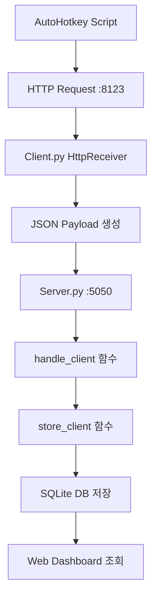
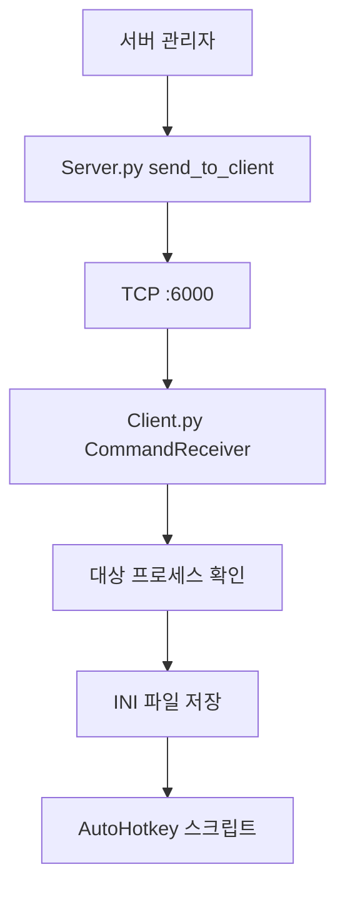
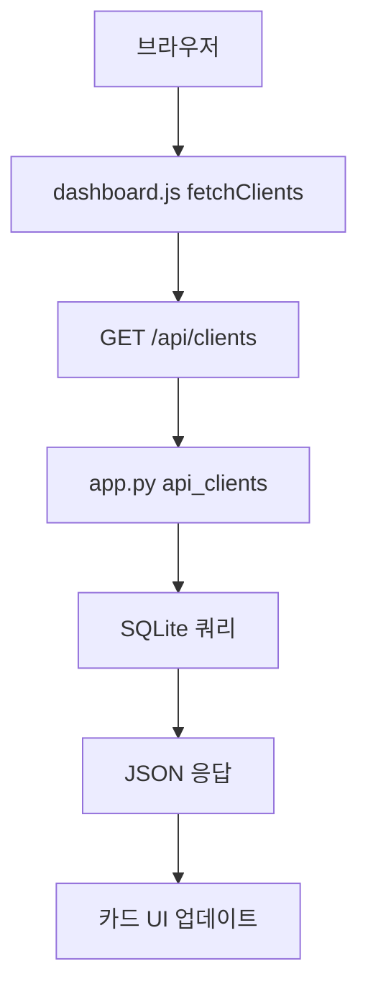

# 🎮 Server-Client 게임 모니터링 시스템 분석 문서

## 📋 목차
1. [프로젝트 개요](#프로젝트-개요)
2. [프로젝트 구조](#프로젝트-구조)
3. [핵심 컴포넌트 분석](#핵심-컴포넌트-분석)
4. [데이터베이스 구조](#데이터베이스-구조)
5. [시스템 워크플로우](#시스템-워크플로우)
6. [컴포넌트 관계도](#컴포넌트-관계도)
7. [현재 문제점 및 개선사항](#현재-문제점-및-개선사항)

---

## 🎯 프로젝트 개요

이 프로젝트는 **다중 게임 클라이언트 모니터링 시스템**으로, 여러 VM 환경에서 실행되는 게임 봇들의 상태를 실시간으로 수집하고 웹 대시보드를 통해 모니터링하는 시스템입니다.

### 주요 목적
- 게임 클라이언트들의 실시간 상태 모니터링 (다이아, 서버, 메시지 등)
- 중앙 집중식 관리 및 명령 전송
- 웹 기반 대시보드를 통한 시각적 모니터링
- 히스토리 데이터 분석 및 트렌드 추적

---

## 📁 프로젝트 구조

```
server_client_project1/
├── 📂 server/                    # 서버 컴포넌트
│   ├── server.py                 # 메인 TCP 서버 (포트 5050)
│   ├── server_send.py           # 클라이언트 명령 송신 모듈
│   ├── settings.json            # 서버 설정 파일
│   ├── client_status.db         # SQLite 데이터베이스
│   └── server_log.txt           # 서버 로그 파일
│
├── 📂 client/                    # 클라이언트 컴포넌트
│   ├── client.py                # 메인 클라이언트 (v2.3.6-stealth)
│   ├── config.json              # 클라이언트 설정 파일
│   ├── client_debug.log         # 클라이언트 로그
│   ├── MessageCache.txt         # 수신 메시지 캐시
│   ├── VERSION.txt              # 버전 정보
│   └── 📂 dist/client.exe       # PyInstaller 빌드 결과
│
├── 📂 board/                     # 웹 대시보드
│   ├── app.py                   # Flask 웹 서버 (포트 8000)
│   ├── 📂 templates/
│   │   └── dashboard.html       # 메인 대시보드 UI
│   └── 📂 static/
│       ├── dashboard.js         # 클라이언트 사이드 JavaScript
│       └── dia-history.html     # 다이아 히스토리 페이지
│
└── 📂 .git/                     # Git 저장소
```

---

## 🔧 핵심 컴포넌트 분석

### 1. 🖥️ Server (server.py)
**역할**: 클라이언트들로부터 상태 데이터를 수신하고 데이터베이스에 저장

#### 주요 함수들:
- `handle_client()`: 클라이언트 연결 처리 및 JSON 데이터 파싱
- `store_client()`: 수신 데이터를 SQLite DB에 저장
- `watch_ahk()`: 클라이언트 생존 감시 (백그라운드 스레드)
- `send_to_client()`: 클라이언트로 명령 전송 (TCP 6000 포트)
- `load_config()`: settings.json 설정 파일 로드

#### 포트 설정:
- **수신 포트**: 5050 (클라이언트 → 서버)
- **송신 포트**: 6000 (서버 → 클라이언트)

#### 데이터 처리 흐름:
1. 클라이언트로부터 JSON 데이터 수신
2. `payload` 파싱 (name, ip, dia, game, server, msg)
3. `store_client()`로 DB에 저장
4. 로그 출력 및 생존 시간 갱신

### 2. 💻 Client (client.py)
**역할**: 게임 프로세스 모니터링 및 서버와의 양방향 통신

#### 주요 함수들:
- `is_target_running()`: 대상 프로세스 실행 상태 확인
- `send_to_server()`: 서버로 상태 데이터 전송
- `CommandReceiver`: 서버 명령 수신 스레드 (포트 6000)
- `HttpReceiver`: AutoHotkey HTTP 요청 수신 (포트 8123)
- `save_command_to_ini()`: 수신 명령을 INI 파일로 저장
- `manage_debug_log()`: 로그 파일 크기/날짜 관리

#### 스텔스 모드 기능:
- 대상 프로세스가 실행 중일 때만 명령 처리
- 민감한 명령어는 별도 처리 (RESTART, SHUTDOWN 등)
- Mutex를 통한 중복 실행 방지

#### 포트 설정:
- **명령 수신**: 6000 (서버 → 클라이언트)
- **HTTP 수신**: 8123 (AutoHotkey → 클라이언트)
- **서버 전송**: 54321 (클라이언트 → 서버)

### 3. 🌐 Web Dashboard (board/app.py)
**역할**: Flask 기반 웹 인터페이스 제공

#### 주요 라우트:
- `GET /`: 메인 대시보드 페이지 렌더링
- `GET /api/clients`: 클라이언트 상태 데이터 API (JSON)
- `GET /dia-history`: 다이아 히스토리 페이지
- `GET /api/dia-history`: 다이아 히스토리 데이터 API

#### 특징:
- 실시간 데이터 갱신 (JavaScript fetch)
- 카드 기반 UI with 드래그 앤 드롭
- 서버별/클라이언트별 필터링
- 다이아 트렌드 차트 기능

---

## 🗃️ 데이터베이스 구조

### SQLite Database: `server/client_status.db`

#### 테이블 1: `clients` (실시간 상태)
```sql
CREATE TABLE clients (
    name TEXT PRIMARY KEY,      -- 클라이언트명
    ip TEXT,                    -- IP 주소
    game TEXT,                  -- 게임명
    server TEXT,                -- 게임 서버명
    dia INTEGER,                -- 다이아 수량
    last_report TEXT,           -- 마지막 보고 시간
    status TEXT,                -- 상태 (alive, offline 등)
    message TEXT                -- 상태 메시지
);
```

#### 테이블 2: `daily_dia` (일별 히스토리)
```sql
CREATE TABLE daily_dia (
    date TEXT NOT NULL,         -- 날짜 (YYYY-MM-DD)
    name TEXT NOT NULL,         -- 클라이언트명
    ip TEXT,                    -- IP 주소
    game TEXT,                  -- 게임명
    server TEXT,                -- 게임 서버명
    dia INTEGER,                -- 다이아 수량
    status TEXT,                -- 상태
    message TEXT,               -- 메시지
    PRIMARY KEY (date, name)    -- 복합 기본키
);
```

---

## 🔄 시스템 워크플로우

### 1. 일반적인 데이터 수집 흐름


### 2. 명령 전송 흐름


### 3. 웹 대시보드 데이터 흐름


---

## 🔗 컴포넌트 관계도

```
┌─────────────────┐    HTTP :8123     ┌─────────────────┐
│  AutoHotkey     │ ─────────────────> │   Client.py     │
│  Scripts        │                    │  (각 VM별)      │
└─────────────────┘                    └─────────────────┘
                                              │
                                              │ TCP :5050
                                              │ (상태 전송)
                                              ▼
                                       ┌─────────────────┐
                                       │   Server.py     │
                                       │  (중앙 서버)    │
                                       └─────────────────┘
                                              │
                                              │ SQLite
                                              ▼
                                       ┌─────────────────┐
                                       │ client_status.db│
                                       │ ┌─ clients     │
                                       │ └─ daily_dia   │
                                       └─────────────────┘
                                              │
                                              │ Query
                                              ▼
                                       ┌─────────────────┐
                                       │   Flask App     │
                                       │  (board/app.py) │
                                       └─────────────────┘
                                              │
                                              │ HTTP :8000
                                              ▼
                                       ┌─────────────────┐
                                       │  Web Browser    │
                                       │   Dashboard     │
                                       └─────────────────┘
```

---

## ⚠️ 현재 문제점 및 개선사항

### 🐛 발견된 문제점들

#### 1. 포트 설정 불일치
- **client/config.json**: `send_port: 54321, recv_port: 6000`
- **server/settings.json**: `server_port: 54321`
- **server.py 코드**: 실제로는 `5050` 포트 사용
- **해결방안**: 설정 파일과 실제 코드의 포트 번호 통일 필요

#### 2. 중복 폴더 구조
- `server_client_project/`와 `server_client_project1/` 동시 존재
- 개발 중 혼란 야기 가능
- **해결방안**: 사용하지 않는 폴더 정리 또는 명확한 역할 구분

#### 3. 하드코딩된 설정값
- client.py에서 일부 포트 번호가 하드코딩됨
- IP 주소가 설정 파일과 코드에 분산
- **해결방안**: 모든 설정을 config 파일로 통일

#### 4. 오류 처리 부족
- 네트워크 단절 시 재연결 로직 없음
- 데이터베이스 락 상황 처리 미흡
- **해결방안**: Robust한 예외 처리 및 재연결 메커니즘 추가

### 🔧 권장 개선사항

#### 1. 보안 강화
- 현재 평문 통신 → TLS/SSL 암호화 적용
- 인증 메커니즘 추가 (API 키, JWT 등)
- 웹 대시보드 접근 권한 제어

#### 2. 모니터링 강화
- Health check 엔드포인트 추가
- 알림 시스템 구축 (이메일, Slack 등)
- 더 상세한 로그 레벨 구분

#### 3. 성능 최적화
- 데이터베이스 인덱스 최적화
- 웹 대시보드 실시간 업데이트 (WebSocket)
- 대용량 데이터 처리를 위한 페이지네이션

#### 4. 운영 편의성
- Docker 컨테이너화
- systemd 서비스 등록 스크립트
- 백업/복원 자동화 스크립트
- 설정 파일 검증 도구

---

## 📝 사용법 요약

### 시스템 시작 순서
1. **서버 시작**: `python server/server.py` (포트 5050 대기)
2. **웹 대시보드 시작**: `python board/app.py` (포트 8000 대기)
3. **클라이언트 시작**: `python client/client.py` (각 VM에서)

### 주요 URL
- **메인 대시보드**: `http://localhost:8000/`
- **다이아 히스토리**: `http://localhost:8000/dia-history`
- **API 엔드포인트**: `http://localhost:8000/api/clients`

### 설정 파일 위치
- 서버: `server/settings.json`
- 클라이언트: `client/config.json`
- 데이터베이스: `server/client_status.db`

---

**📅 문서 작성일**: 2025-01-14
**🔄 마지막 업데이트**: 프로젝트 v2.3.6-stealth 기준
**👤 분석자**: Claude Code Assistant